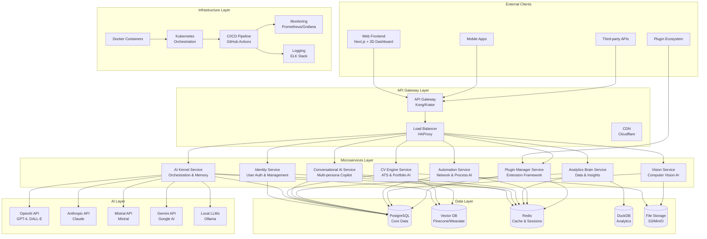
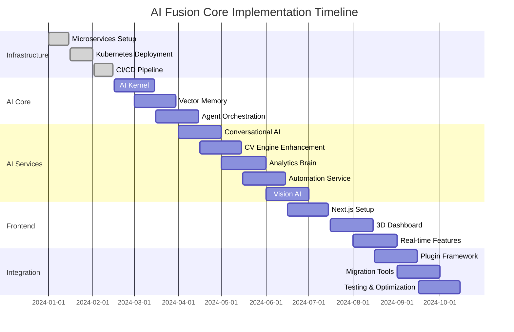

# AI Fusion Core - System Architecture Design

## Executive Summary

This document outlines the complete architectural transformation of the existing ATS-friendly CV web application into **AI Fusion Core** - a comprehensive AI platform that extends beyond CV management to become a full-featured AI ecosystem.

## 1. Current State Analysis

### Existing Architecture
- **Framework**: Monolithic FastAPI application
- **Database**: PostgreSQL with SQLAlchemy ORM
- **AI Integration**: Basic OpenAI integration for CV content generation
- **Frontend**: Basic HTML/CSS/JavaScript templates
- **Key Models**: User, CV, CVSection
- **Core Features**: CV creation, ATS optimization, basic AI content generation

### Migration Points Identified
1. **Database Layer**: Existing PostgreSQL schema can evolve to support microservices
2. **AI Service**: Current AI service can be extended into the AI kernel
3. **Authentication**: Existing JWT auth can be centralized in identity service
4. **File Handling**: Current file utilities can be enhanced for multi-modal AI
5. **API Structure**: Current REST endpoints can be extended with gRPC

## 2. High-Level Architecture Diagram



## 3. Core Transformation Layer

### 3.1 FastAPI Microservices Architecture

#### Service Communication Strategy
- **gRPC**: High-performance inter-service communication
- **Protocol Buffers**: Efficient serialization for service contracts
- **Service Mesh**: Istio for traffic management and observability

#### Base Service Template
```python
# Base service structure
class BaseMicroservice:
    def __init__(self, service_name: str):
        self.service_name = service_name
        self.grpc_server = grpc.server()
        self.health_checker = HealthChecker()

    async def start(self, port: int):
        """Start gRPC server"""
        self.grpc_server.add_insecure_port(f'[::]:{port}')
        await self.grpc_server.start()
        logger.info(f"{self.service_name} started on port {port}")

    async def stop(self):
        """Graceful shutdown"""
        await self.grpc_server.stop(grace=30)
```

### 3.2 Dynamic AI Kernel Architecture

#### Core Components
1. **Reasoning Engine**: Multi-step task planning and execution
2. **Orchestration Layer**: Agent coordination and workflow management
3. **Memory System**: Vector-based long-term and short-term memory
4. **Tool Integration**: Dynamic tool loading and execution

#### AI Kernel Structure
```python
class AIKernel:
    def __init__(self):
        self.reasoning_engine = ReasoningEngine()
        self.orchestrator = AgentOrchestrator()
        self.memory_manager = VectorMemoryManager()
        self.tool_registry = ToolRegistry()

    async def process_request(
        self,
        request: AIRequest,
        context: ExecutionContext
    ) -> AIResponse:
        """Main request processing pipeline"""
        # 1. Reasoning and planning
        plan = await self.reasoning_engine.plan(request)

        # 2. Memory retrieval
        context = await self.memory_manager.retrieve_context(plan)

        # 3. Agent orchestration
        result = await self.orchestrator.execute(plan, context)

        # 4. Memory storage
        await self.memory_manager.store_result(result)

        return result
```

#### LangChain + AutoGen Integration
```python
class MultiAgentSystem:
    def __init__(self):
        self.langchain_agents = {}
        self.autogen_groups = {}
        self.communication_bus = MessageBus()

    async def create_agent_group(
        self,
        task_type: str,
        agents: List[str]
    ) -> ConversableAgent:
        """Create collaborative agent group"""
        group_chat = GroupChat(
            agents=agents,
            messages=[],
            max_round=10
        )
        return group_chat
```

## 4. Modular AI Services Architecture

### 4.1 Conversational AI Copilot Service

#### Multi-Persona Architecture
```python
class ConversationalAICopilot:
    def __init__(self):
        self.personas = {
            "career_coach": CareerCoachPersona(),
            "technical_interviewer": TechnicalInterviewerPersona(),
            "writing_assistant": WritingAssistantPersona(),
            "data_analyst": DataAnalystPersona()
        }
        self.context_manager = ContextManager()
        self.memory = ConversationMemory()

    async def chat(
        self,
        message: str,
        persona: str,
        user_id: str
    ) -> StreamingResponse:
        """Multi-persona conversational interface"""
        persona_agent = self.personas.get(persona)
        context = await self.context_manager.get_context(user_id)

        return StreamingResponse(
            persona_agent.chat(message, context)
        )
```

### 4.2 AI CV & Portfolio Engine

#### Extended ATS Features
```python
class AICVEngine:
    def __init__(self):
        self.ats_optimizer = ATSOptimizer()
        self.portfolio_generator = PortfolioGenerator()
        self.skill_analyzer = SkillAnalyzer()
        self.career_predictor = CareerPredictor()

    async def generate_optimized_cv(
        self,
        user_profile: UserProfile,
        job_requirements: JobRequirements
    ) -> OptimizedCV:
        """Generate ATS-optimized CV with AI insights"""
        # 1. Analyze job requirements
        requirements = await self.ats_optimizer.analyze_job(job_requirements)

        # 2. Optimize existing content
        optimized_content = await self.ats_optimizer.optimize_content(
            user_profile, requirements
        )

        # 3. Generate portfolio recommendations
        portfolio = await self.portfolio_generator.create_portfolio(
            user_profile, requirements
        )

        # 4. Predict career trajectory
        career_path = await self.career_predictor.predict_path(user_profile)

        return OptimizedCV(
            content=optimized_content,
            ats_score=requirements.score,
            portfolio=portfolio,
            career_insights=career_path
        )
```

### 4.3 Data & Analytics Brain

#### Multi-Engine Analytics
```python
class AnalyticsBrain:
    def __init__(self):
        self.postgresql_engine = PostgreSQLEngine()
        self.duckdb_engine = DuckDBEngine()
        self.vector_analytics = VectorAnalytics()
        self.ml_insights = MLInsightsEngine()

    async def generate_insights(
        self,
        data_sources: List[str],
        analysis_type: str
    ) -> AnalyticsReport:
        """Multi-source data analysis"""
        # 1. Query structured data
        structured_data = await self.postgresql_engine.query(data_sources)

        # 2. Process with DuckDB for analytics
        analytics_data = await self.duckdb_engine.analyze(structured_data)

        # 3. Vector similarity analysis
        vector_insights = await self.vector_analytics.find_patterns(analytics_data)

        # 4. ML-powered predictions
        predictions = await self.ml_insights.predict_trends(analytics_data)

        return AnalyticsReport(
            data=analytics_data,
            insights=vector_insights,
            predictions=predictions
        )
```

### 4.4 Automation & Networking Intelligence

#### Network-Aware Automation
```python
class AutomationIntelligence:
    def __init__(self):
        self.snmp_monitor = SNMPMonitor()
        self.netflow_analyzer = NetFlowAnalyzer()
        self.process_automator = ProcessAutomator()
        self.anomaly_detector = AnomalyDetector()

    async def monitor_network_health(
        self,
        network_targets: List[str]
    ) -> NetworkHealthReport:
        """AI-powered network monitoring"""
        # 1. SNMP data collection
        snmp_data = await self.snmp_monitor.collect_data(network_targets)

        # 2. NetFlow analysis
        flow_patterns = await self.netflow_analyzer.analyze_traffic(snmp_data)

        # 3. Anomaly detection
        anomalies = await self.anomaly_detector.detect_issues(flow_patterns)

        # 4. Automated remediation
        remediation = await self.process_automator.generate_fixes(anomalies)

        return NetworkHealthReport(
            status=snmp_data,
            patterns=flow_patterns,
            issues=anomalies,
            fixes=remediation
        )
```

### 4.5 Computer Vision & Media AI

#### Multi-Modal AI Processing
```python
class VisionAIService:
    def __init__(self):
        self.opencv_processor = OpenCVProcessor()
        self.clip_analyzer = CLIPAnalyzer()
        self.stable_diffusion = StableDiffusionGenerator()
        self.video_analyzer = VideoAnalyzer()

    async def process_media(
        self,
        media_input: MediaInput,
        task_type: str
    ) -> MediaOutput:
        """Multi-modal media processing"""
        if task_type == "image_analysis":
            return await self.clip_analyzer.analyze_image(media_input)
        elif task_type == "image_generation":
            return await self.stable_diffusion.generate_image(media_input)
        elif task_type == "video_analysis":
            return await self.video_analyzer.analyze_video(media_input)
        elif task_type == "object_detection":
            return await self.opencv_processor.detect_objects(media_input)
```

## 5. Data Architecture Evolution

### 5.1 Database Schema Design

#### Enhanced User Model
```sql
-- Enhanced user table with AI preferences
CREATE TABLE users (
    id SERIAL PRIMARY KEY,
    email VARCHAR(255) UNIQUE NOT NULL,
    username VARCHAR(100) UNIQUE NOT NULL,
    full_name VARCHAR(255) NOT NULL,
    hashed_password VARCHAR(255) NOT NULL,
    is_active BOOLEAN DEFAULT true,
    is_superuser BOOLEAN DEFAULT false,
    ai_preferences JSONB, -- AI model preferences, personas, etc.
    created_at TIMESTAMPTZ DEFAULT NOW(),
    updated_at TIMESTAMPTZ DEFAULT NOW()
);

-- AI conversation history
CREATE TABLE ai_conversations (
    id SERIAL PRIMARY KEY,
    user_id INTEGER REFERENCES users(id),
    persona VARCHAR(50) NOT NULL,
    message TEXT NOT NULL,
    response TEXT NOT NULL,
    metadata JSONB,
    created_at TIMESTAMPTZ DEFAULT NOW()
);

-- Vector embeddings for memory
CREATE TABLE vector_memory (
    id SERIAL PRIMARY KEY,
    user_id INTEGER REFERENCES users(id),
    content_type VARCHAR(50) NOT NULL, -- 'conversation', 'cv', 'analysis'
    content_vector VECTOR(1536), -- OpenAI embedding dimension
    metadata JSONB,
    created_at TIMESTAMPTZ DEFAULT NOW()
);
```

### 5.2 Vector Database Strategy

#### Pinecone/Weaviate Integration
```python
class VectorMemoryManager:
    def __init__(self):
        self.vector_db = PineconeVectorDB()
        self.embedding_model = OpenAIEmbeddings()

    async def store_memory(
        self,
        content: str,
        metadata: Dict,
        user_id: str
    ) -> str:
        """Store content with vector embeddings"""
        # Generate embedding
        embedding = await self.embedding_model.embed(content)

        # Store in vector database
        memory_id = await self.vector_db.store(
            vector=embedding,
            metadata={**metadata, "user_id": user_id, "content": content}
        )

        return memory_id

    async def retrieve_context(
        self,
        query: str,
        user_id: str,
        limit: int = 5
    ) -> List[Memory]:
        """Retrieve relevant context using similarity search"""
        query_embedding = await self.embedding_model.embed(query)

        results = await self.vector_db.search(
            vector=query_embedding,
            filter={"user_id": user_id},
            limit=limit
        )

        return [Memory.from_db(result) for result in results]
```

## 6. API Design Specifications

### 6.1 REST API Endpoints

#### AI Kernel API
```python
# AI Kernel endpoints
@app.post("/api/v2/ai/process")
async def process_ai_request(request: AIRequest):
    """Unified AI processing endpoint"""

@app.get("/api/v2/ai/personas")
async def list_personas():
    """List available AI personas"""

@app.post("/api/v2/ai/memory/search")
async def search_memory(query: MemoryQuery):
    """Search vector memory"""
```

#### CV Engine API
```python
# Enhanced CV endpoints
@app.post("/api/v2/cv/optimize")
async def optimize_cv(cv_data: CVData, job_desc: str):
    """AI-powered CV optimization"""

@app.get("/api/v2/cv/portfolio/{user_id}")
async def generate_portfolio(user_id: int):
    """Generate AI-powered portfolio"""

@app.get("/api/v2/cv/career-path/{user_id}")
async def predict_career_path(user_id: int):
    """Predict career trajectory"""
```

### 6.2 gRPC Service Definitions

#### Protocol Buffer Definitions
```protobuf
// AI Kernel service
service AIKernel {
    rpc ProcessRequest(AIRequest) returns (AIResponse);
    rpc SearchMemory(MemoryQuery) returns (MemoryResults);
    rpc CreateAgent(AgentConfig) returns (AgentInfo);
}

// CV Engine service
service CVEngine {
    rpc OptimizeCV(CVOptimizationRequest) returns (OptimizedCV);
    rpc GeneratePortfolio(PortfolioRequest) returns (PortfolioResponse);
    rpc AnalyzeCareer(CareerAnalysisRequest) returns (CareerAnalysisResponse);
}
```

### 6.3 GraphQL Schema

#### Core GraphQL Types
```graphql
type Query {
    user(id: ID!): User
    cv(id: ID!): CV
    aiPersonas: [AIPersona!]!
    memorySearch(query: String!, limit: Int): [Memory!]!
}

type Mutation {
    optimizeCV(cvId: ID!, jobDescription: String!): CVOptimizationResult!
    createConversation(persona: String!, message: String!): Conversation!
    generatePortfolio(userId: ID!): Portfolio!
}

type Subscription {
    aiResponse(conversationId: ID!): AIResponse!
    cvOptimizationProgress(cvId: ID!): OptimizationProgress!
}
```

## 7. Frontend Evolution Strategy

### 7.1 Next.js Architecture

#### Component Architecture
```typescript
// Core layout components
interface AIFusionLayoutProps {
    children: React.ReactNode;
    sidebar?: React.ReactNode;
    header?: React.ReactNode;
}

// 3D Dashboard component
const AIDashboard3D: React.FC = () => {
    return (
        <Canvas camera={{ position: [0, 0, 5] }}>
            <ambientLight intensity={0.5} />
            <pointLight position={[10, 10, 10]} />
            <AIServiceNodes />
            <DataFlowVisualization />
        </Canvas>
    );
};
```

### 7.2 Real-time Collaboration

#### Y.js WebSocket Integration
```typescript
class CollaborativeEditor {
    constructor(documentId: string) {
        this.ws = new WebSocket('ws://localhost:3001/collaboration');
        this.ydoc = new Y.Doc();
        this.provider = new WebsocketProvider(
            'ws://localhost:3001',
            documentId,
            this.ydoc
        );
    }

    getSharedText(key: string): Y.Text {
        return this.ydoc.getText(key);
    }
}
```

## 8. Plugin Framework Architecture

### 8.1 Plugin System Design

#### Plugin Interface
```python
class AIFusionPlugin(ABC):
    @abstractmethod
    def get_name(self) -> str:
        """Plugin name"""

    @abstractmethod
    def get_version(self) -> str:
        """Plugin version"""

    @abstractmethod
    def get_capabilities(self) -> List[PluginCapability]:
        """List of plugin capabilities"""

    @abstractmethod
    async def initialize(self, config: Dict) -> bool:
        """Initialize plugin"""

    @abstractmethod
    async def execute(self, action: str, params: Dict) -> Any:
        """Execute plugin action"""
```

#### Plugin Registry
```python
class PluginManager:
    def __init__(self):
        self.plugins: Dict[str, AIFusionPlugin] = {}
        self.capability_index: Dict[str, List[str]] = {}

    async def load_plugin(self, plugin_path: str) -> bool:
        """Load plugin dynamically"""
        plugin_class = self._load_plugin_class(plugin_path)
        plugin = plugin_class()

        if await plugin.initialize({}):
            self.plugins[plugin.get_name()] = plugin
            self._index_capabilities(plugin)
            return True
        return False

    async def execute_capability(
        self,
        capability: str,
        params: Dict
    ) -> List[Any]:
        """Execute all plugins with given capability"""
        plugin_names = self.capability_index.get(capability, [])
        results = []

        for plugin_name in plugin_names:
            plugin = self.plugins[plugin_name]
            result = await plugin.execute(capability, params)
            results.append(result)

        return results
```

## 9. Infrastructure & Deployment

### 9.1 Docker & Kubernetes Strategy

#### Multi-stage Dockerfile
```dockerfile
# Base stage
FROM python:3.11-slim as base
WORKDIR /app
COPY requirements.txt .

# Development stage
FROM base as development
RUN pip install -r requirements.txt
COPY . .
CMD ["uvicorn", "main:app", "--reload"]

# Production stage
FROM base as production
RUN pip install -r requirements.txt
COPY . .
RUN python -m compileall .
CMD ["uvicorn", "main:app", "--host", "0.0.0.0", "--port", "8000"]
```

#### Kubernetes Deployment
```yaml
apiVersion: apps/v1
kind: Deployment
metadata:
  name: ai-kernel-service
spec:
  replicas: 3
  selector:
    matchLabels:
      app: ai-kernel
  template:
    metadata:
      labels:
        app: ai-kernel
    spec:
      containers:
      - name: ai-kernel
        image: ai-fusion/ai-kernel:latest
        ports:
        - containerPort: 8000
        - containerPort: 50051  # gRPC
        env:
        - name: DATABASE_URL
          valueFrom:
            secretKeyRef:
              name: database-secret
              key: url
```

### 9.2 CI/CD Pipeline

#### GitHub Actions Workflow
```yaml
name: AI Fusion Core CI/CD
on:
  push:
    branches: [main, develop]
  pull_request:
    branches: [main]

jobs:
  test:
    runs-on: ubuntu-latest
    steps:
    - uses: actions/checkout@v3
    - name: Set up Python
      uses: actions/setup-python@v4
      with:
        python-version: '3.11'
    - name: Install dependencies
      run: |
        python -m pip install --upgrade pip
        pip install -r requirements.txt
    - name: Run tests
      run: pytest

  build-and-deploy:
    needs: test
    runs-on: ubuntu-latest
    if: github.ref == 'refs/heads/main'
    steps:
    - name: Build and push Docker images
      run: |
        docker build -t ai-fusion/ai-kernel:${{ github.sha }} .
        docker push ai-fusion/ai-kernel:${{ github.sha }}
    - name: Deploy to Kubernetes
      run: kubectl apply -f k8s/
```

## 10. Integration Strategy

### 10.1 Backward Compatibility Plan

#### Migration Phases
1. **Phase 1**: Parallel deployment with feature flags
2. **Phase 2**: Gradual migration of existing users
3. **Phase 3**: Deprecation of legacy endpoints

#### Feature Flag System
```python
class FeatureFlagManager:
    def __init__(self):
        self.flags = {
            "ai_kernel_v2": True,
            "legacy_cv_api": True,
            "new_frontend": False
        }

    def is_enabled(self, feature: str) -> bool:
        return self.flags.get(feature, False)

    def enable_feature(self, feature: str):
        self.flags[feature] = True

    def disable_feature(self, feature: str):
        self.flags[feature] = False
```

## 11. Technology Roadmap

### 11.1 Phased Implementation Plan

#### Phase 1: Foundation (Weeks 1-4)
- [ ] Set up microservices infrastructure
- [ ] Implement AI kernel with basic orchestration
- [ ] Create vector memory system
- [ ] Deploy core services to Kubernetes

#### Phase 2: AI Services (Weeks 5-8)
- [ ] Implement conversational AI copilot
- [ ] Enhance CV engine with new features
- [ ] Build analytics brain service
- [ ] Create automation intelligence service

#### Phase 3: Advanced Features (Weeks 9-12)
- [ ] Implement computer vision service
- [ ] Build plugin framework
- [ ] Develop Next.js 3D dashboard
- [ ] Add real-time collaboration features

#### Phase 4: Optimization (Weeks 13-16)
- [ ] Performance optimization
- [ ] Security hardening
- [ ] Scalability testing
- [ ] Documentation and training

### 11.2 Dependency Mapping



## 12. Scalability Plan

### 12.1 Horizontal Scaling Strategy

#### Service Scaling Rules
```yaml
apiVersion: autoscaling/v2
kind: HorizontalPodAutoscaler
metadata:
  name: ai-kernel-hpa
spec:
  scaleTargetRef:
    apiVersion: apps/v1
    kind: Deployment
    name: ai-kernel
  minReplicas: 3
  maxReplicas: 20
  metrics:
  - type: Resource
    resource:
      name: cpu
      target:
        type: Utilization
        averageUtilization: 70
  - type: Resource
    resource:
      name: memory
      target:
        type: Utilization
        averageUtilization: 80
```

### 12.2 Performance Optimization

#### Caching Strategy
```python
class MultiLevelCache:
    def __init__(self):
        self.redis_cache = RedisCache()  # Hot data
        self.memory_cache = LRUCache()   # Session data
        self.disk_cache = DiskCache()    # Cold data

    async def get(self, key: str) -> Any:
        # 1. Check memory cache first
        if value := self.memory_cache.get(key):
            return value

        # 2. Check Redis cache
        if value := await self.redis_cache.get(key):
            self.memory_cache.put(key, value)
            return value

        # 3. Check disk cache
        if value := await self.disk_cache.get(key):
            await self.redis_cache.set(key, value)
            return value

        return None
```

## 13. Security & Compliance Architecture

### 13.1 End-to-End Security

#### Authentication & Authorization
```python
class SecurityManager:
    def __init__(self):
        self.jwt_manager = JWTManager()
        self.oauth_provider = OAuthProvider()
        self.rbac_system = RoleBasedAccessControl()

    async def authenticate_request(
        self,
        token: str,
        required_permissions: List[str]
    ) -> User:
        """Authenticate and authorize request"""
        # 1. Validate JWT token
        user = await self.jwt_manager.validate_token(token)

        # 2. Check OAuth if needed
        if not user:
            user = await self.oauth_provider.authenticate(token)

        # 3. Verify permissions
        if not self.rbac_system.has_permissions(user, required_permissions):
            raise PermissionDeniedError()

        return user
```

### 13.2 Data Protection

#### Encryption Strategy
```python
class DataProtectionManager:
    def __init__(self):
        self.field_encryptor = FieldLevelEncryptor()
        self.tls_manager = TLSManager()
        self.kms_integration = KMSIntegration()

    async def encrypt_sensitive_data(self, data: Dict) -> Dict:
        """Encrypt sensitive fields in data"""
        encrypted_data = {}

        for key, value in data.items():
            if self._is_sensitive_field(key):
                encrypted_data[key] = await self.field_encryptor.encrypt(value)
            else:
                encrypted_data[key] = value

        return encrypted_data

    def _is_sensitive_field(self, field_name: str) -> bool:
        sensitive_fields = {
            'password', 'ssn', 'credit_card', 'api_key',
            'secret', 'token', 'private_key'
        }
        return field_name.lower() in sensitive_fields
```

## Conclusion

This architecture design provides a comprehensive roadmap for transforming the existing ATS-friendly CV application into **AI Fusion Core** - a full-featured AI platform. The design emphasizes:

- **Modularity**: Each AI capability as a self-contained service
- **Scalability**: Microservices architecture with horizontal scaling
- **Extensibility**: Plugin framework for future AI modules
- **Real-time**: WebSocket support for live collaboration
- **Security**: End-to-end encryption and access control

The phased implementation approach ensures backward compatibility while enabling rapid evolution of AI capabilities. The modular design allows for independent scaling and deployment of different AI services based on demand.

**Next Steps**: Present this design to stakeholders for review and proceed with Phase 1 implementation focusing on microservices infrastructure and AI kernel development.